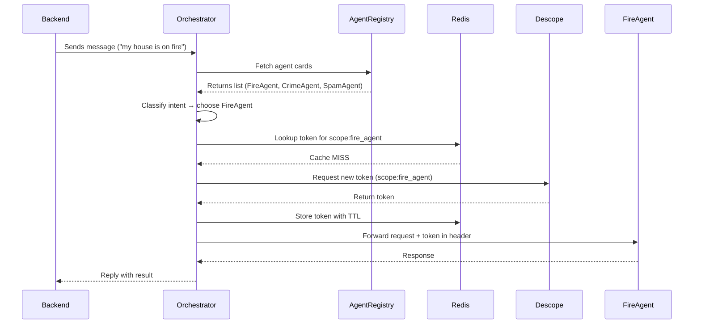

# Orchestrator Agent 🧭

The **Orchestrator Agent** is the brain of Beacon — it’s responsible for **discovering available agents**, classifying user requests, securely fetching scoped tokens, and routing the request to the right agent.


## Overview

When a user message comes in, the Orchestrator does **three things intelligently and securely**:

1. **Discovers Agents** – Fetches the latest **agent cards** (metadata about all available agents).
2. **Classifies Intent** – Uses conversation context + agent cards to pick the **best matching agent** dynamically.
3. **Routes Securely** – Obtains a scoped token (cache-first) and forwards the request with proper authorization.

This allows the system to remain **modular**, **dynamic**, and **secure** even as new agents are added.


## Key Features

### 🗂️ Agent Card Discovery + Dynamic Routing

Instead of hardcoding which agents exist, the orchestrator queries an **agent registry** to fetch all available agent cards:

* **Agent Card** = Metadata containing agent name, description, scope, and endpoint.
* The orchestrator **categorizes the incoming user message** based on agent descriptions.
* Routes the message to the **best-fit agent** (e.g., FireAgent, CrimeAgent, SpamAgent).

This makes it possible to:

* Add or remove agents without redeploying the orchestrator.
* Dynamically adapt to new capabilities in real-time.
* Scale across multiple orchestrators with no configuration drift.


### 🔑 Cache-First Token Retrieval (Redis + Descope)

Once the target agent is chosen, the orchestrator needs a **scoped token** for that agent.
It uses a **cache-first approach** for speed and efficiency:

1. **Lookup in Redis:** Check if a token for the target agent scope exists.
2. **Cache Hit:** Use token immediately (fast).
3. **Cache Miss:**

   * Request a fresh token from **Descope**.
   * Store it in Redis with TTL for reuse.

This design ensures:

* ⚡ **Low latency** agent-to-agent communication.
* 🔒 **Secure, scoped access** for every call.
* ♻️ **Efficient token lifecycle management**.


## Example Flow

**User says:** “My house is on fire.”



---

## Tech Stack

* **Runtime:** FastAPI + Python
* **Token Cache:** Redis (with TTL)
* **Agent Discovery:** Agent Registry (cards fetched dynamically)
* **Auth & Security:** Descope Inbound Apps + OAuth scoped tokens
* **Containerized:** Docker

---

## How to Run
* Run locally:

```bash
source venv/bin/activate
poetry install
cp .env.example .env
python3 -m src.agents.OrchestratorAgent
```
